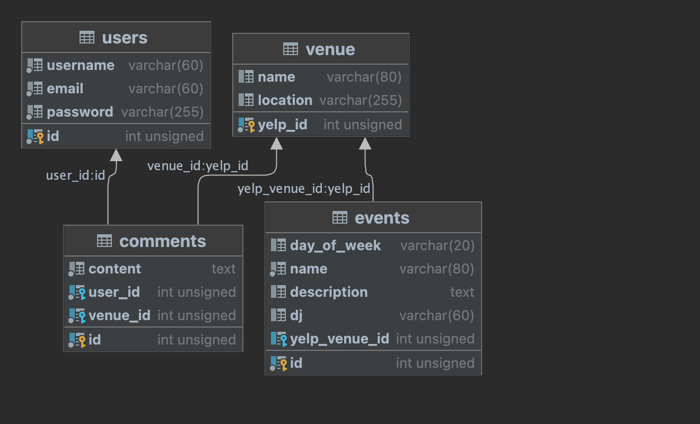

# Karaoke-Hub

## Table of Contents

* [Description](#description)
* [Installation](#installation)
* [Usage](#usage)
* [Languages](#languages)
* [Tests](#tests)
* [Contributors](#contributors)
* [Credits](#credits)

 

## Description
The objective of the Karaoke Hub project is to develop a full stack web application that connects karaoke singers with karaoke venues, DJs, and businesses. The application will allow singers to find nearby karaoke locations, receive push notifications about karaoke events, and provide businesses and DJs a platform to submit their karaoke schedules.

## Installation
1. Navigate to the following link https://github.com/The-WKNDRS/Karaoke-Hub, and clone the project to your local machine.
2. Opened the clone project with Intellij

3. Live Site Setup - 
    1. Terminal command (remove angle brackets):
    cat ~/.ssh/id_rsa.pub | ssh root@<ip_address> dokku ssh-keys:add <admin-yourname>
    
    2. Intellij Terminal command (remove angle brackets):
    git remote add dokku dokku@<159.223.157.65>:<karaoke_hub>

## User Story
1. Visitors have the least privileges. Users have access to all visitor functionality. 
2. As a visitor, when I complete the registration form I expect/want to be told that I have successfully registered and be directed to a welcome screen
3. As a visitor, I can view all karaoke venues and events and search for nearby karaoke venues based on their current location or a specified locations. I can choose a set radius to pull results from.
5. As a visitor, I can view the venue profile page with Yelp reviews and comments.
6. As a user, I can set preferences for karaoke genres, days of the week, and time slots.
7. As a user, I can save my favorite venues and events, manage preferences, and update my profile.
8. As a user, I can create, edit, and delete my comments.
9. As a user, I can create, edit, and delete my events.
10. As a user, I can choose to create a venue profile in order to create events.
11. As a singer, I can give ratings to venues.

## Feature List

MVP

-Register users and login authentication.
-Ensure usernames are unique
-Users can create, edit, and delete their own events
-Ensure there are no duplicate venue creations
-implement MapBox Api
-implement HTML geolocation Api
-Dynamic navbar
-Logout page
-Error messages
-Sticky forms
-Users can update profile
-Users can rate the venue
-Users can search for events near them
-grab user’s location and show events near them
-Mobile responsiveness

MMP

-Allows users to opt in to email reminders for events
-Split users into different roles (Singer, DJ, Venue)
-Only DJs and Venues can create, edit, and delete 
-Users can add favorite venues and events to their profile
-implement ChatGPT Api to generate random songs to sing
-implement Yelp api

## Usage

## Languages
Java , HTML5, CSS, JavaScript

## Tests
NA

## Contributors
https://github.com/Joeab1991 | https://github.com/cybermatt76 | https://github.com/isaacach | https://github.com/NicholasOwens1

## Credits
Joe, Nick, Isaac, Matt
