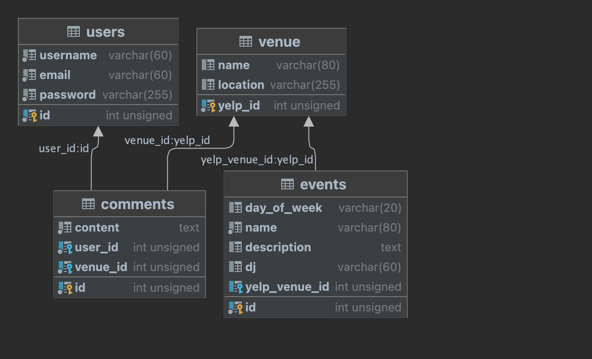

# Karaoke-Hub

## Table of Contents

* [Description](#description)
* [Installation](#installation)
* [Usage](#usage)
* [Languages](#languages)
* [Tests](#tests)
* [Contributors](#contributors)
* [Credits](#credits)

 

## Description
The objective of the Karaoke Hub project is to develop a full stack web application that connects karaoke singers with karaoke venues, DJs, and businesses. The application will allow singers to find nearby karaoke locations, receive push notifications about karaoke events, and provide businesses and DJs a platform to submit their karaoke schedules.

## Installation
1. Navigate to the following link https://github.com/The-WKNDRS/Karaoke-Hub, and clone the project to your local machine.
2. Opened the clone project with Intellij

## User Story
1. Visitors have the least privileges. Singers, and venues have access to all visitor functionality. Functionality that only singers and venues have access to will be assigned to the name “user”.
2. As a visitor, when I complete the registration form I expect/want to be told that I have successfully registered and be directed to a welcome screen
3. As a visitor, I can view all karaoke venues and events and search for nearby karaoke venues based on their current  location or a specified locations. I can choose a set radius to pull results from.
4. As a user, I can set preferences for karaoke genres, days of the week, and time slots.
5. As a user, I can save my favourite venues and events, manage preferences, and update my profile.
6. As a user, I can create, edit, and delete my comments.
7. As a user, I can choose to create a venue profile in order to create events.
8. As a singer, I can give ratings to venues.

## Usage

## Languages
Java , HTML5, CSS, JavaScript

## Tests
NA

## Contributors
https://github.com/Joeab1991 | https://github.com/cybermatt76 | https://github.com/isaacach | https://github.com/NicholasOwens1

## Credits
Joe, Nick, Isaac, Matt
